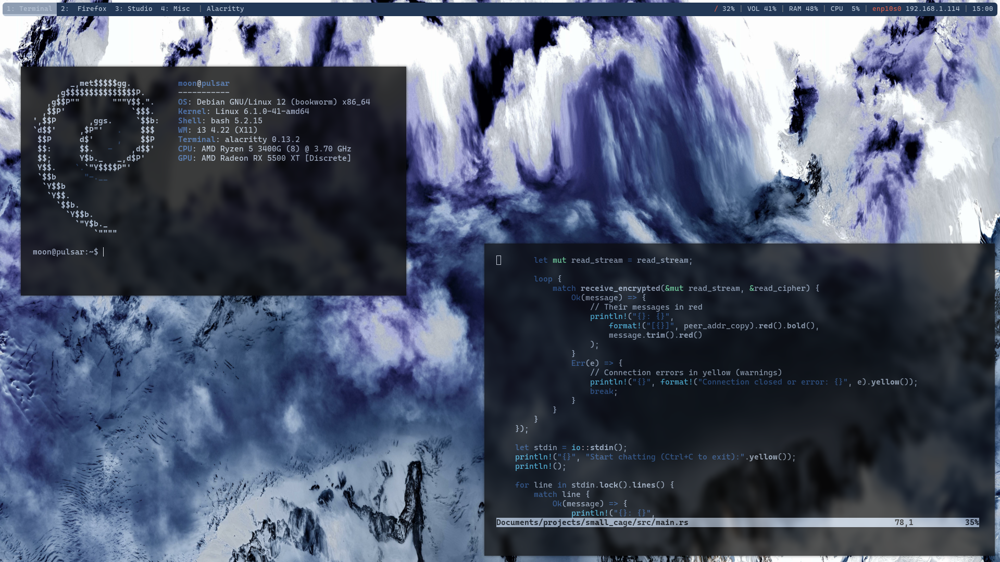
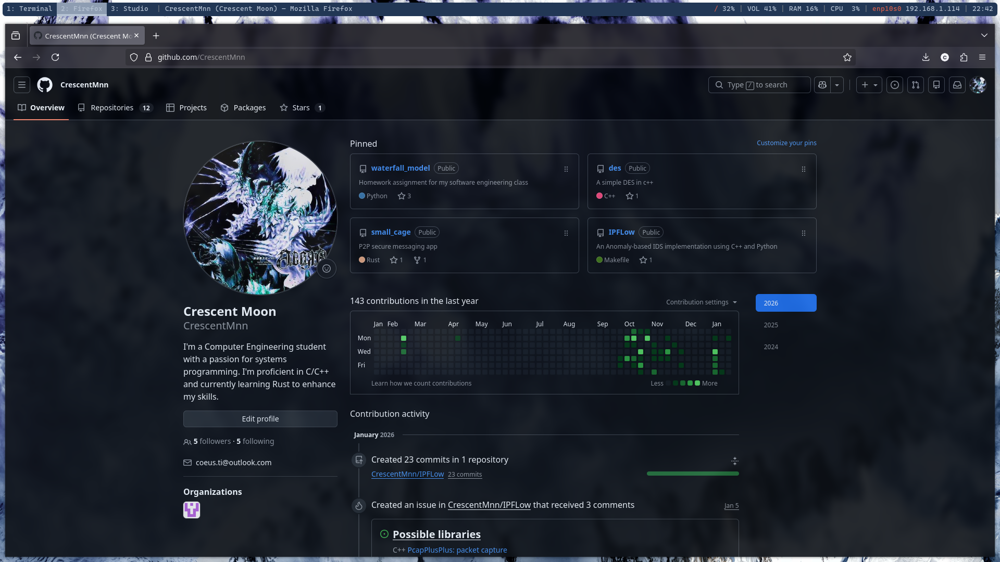
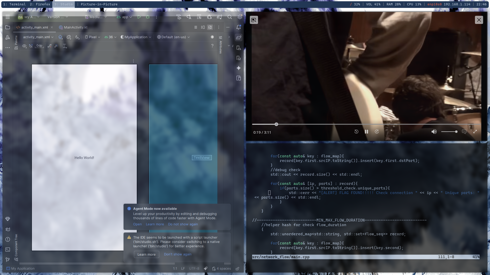
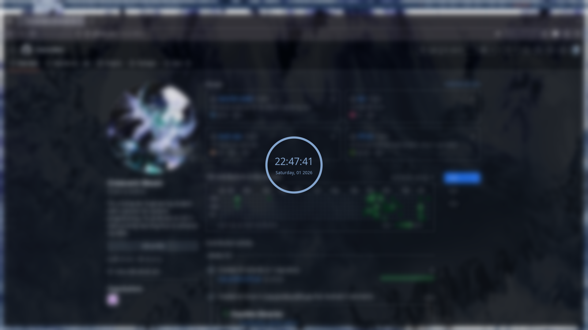

# Debian 12 Dotfiles

This repository contains my personal dotfiles for a Debian 12 (Bookworm) setup focused on a minimal, keyboard-driven workflow. The configuration is built around the i3 window manager, with a lightweight compositor, custom bars, and small scripts to improve daily usability. The goal of this setup is to stay fast, simple, and highly customizable without unnecessary bloat.

These dotfiles are actively used and may evolve over time as I tweak visuals, keybindings, or workflows.

---

## Window Manager

This setup uses **i3** as the window manager. i3 provides a tiling, keyboard-first environment that makes window management efficient and predictable. The configuration focuses on simple layouts, clear keybindings, and fast window navigation without relying on the mouse.

---

## Status Bars and System Information

System information is displayed using **Polybar**, with additional support files for **i3blocks** and **i3status**. These tools are used to show workspace status, system metrics, and other useful indicators. The bar configuration is modular and designed to be easy to modify or extend.

---

## Compositor and Visual Effects

**Picom** is used as the compositor to enable transparency, shadows, and smooth visual effects. The configuration keeps effects subtle to avoid impacting performance while still improving visual clarity and polish.

---

## Scripts and Automation

This setup includes custom scripts to handle startup tasks, bar launching, and small quality-of-life improvements. These scripts are meant to be simple and readable so they can be easily modified or reused.

---

## Images and Assets

Wallpaper files and other visual assets used by the window manager and bars are stored in this repository to keep the setup consistent across systems.

---

## Installation and Usage

To use these dotfiles:

1. Make sure you are running **Debian 12** and have i3 installed.
2. Install the required dependencies such as i3, polybar, picom, and any fonts used by the bar.
3. Back up your existing configuration files before proceeding.
4. Copy or symlink the configuration files into your `~/.config/` directory.
5. Make scripts executable if needed.
6. Restart i3 or log out and log back in to apply the changes.

These dotfiles are intended as a reference and starting point—feel free to adapt them to your own workflow.

---

## Screenshots

### Terminal
_Screenshot showcasing the terminal setup, colorscheme, and font._

---

### Firefox
_Screenshot showing Firefox integrated into the i3 workflow._

---

### Misc / Studio Windows
_Screenshots of miscellaneous applications, development tools, or studio-style windows._

---

### Lock window

_Screenshot showing lock script in function._

## Notes

This configuration prioritizes clarity, speed, and maintainability over heavy customization. Some parts may be specific to my hardware or preferences, so minor adjustments may be required when using it on a different system.

